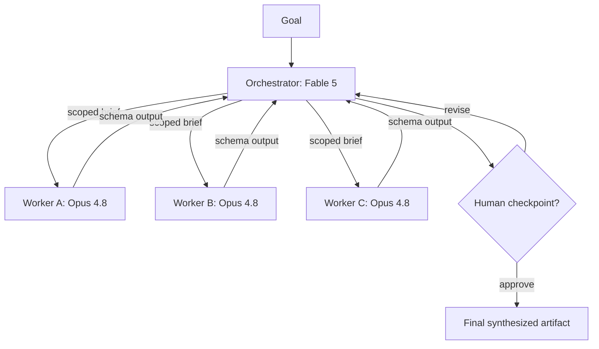

# ORCHESTRATION_STANDARD.md

One canonical standard for designing and running two-layer multi-agent workflows: a Fable 5 orchestrator planning and synthesizing, Opus 4.8 workers executing.

---

## 1. Purpose and Scope

This standard governs every multi-agent build at The Creative Strategist: Claude Code projects, API-driven agent systems inside the client portal, market research agents, content pipelines, and internal automation.

**Apply this standard when all three are true:**

1. The goal decomposes into two or more meaningfully different subtasks.
2. At least one subtask involves execution work (code, research, drafting, tool calls), not just a single answer.
3. The output will be reused, shipped to a client, or run more than once.

**Do not apply this standard when:**

- The task is a single prompt to a single model. One model call with a good prompt beats an orchestration layer every time the task fits in one context window and one skill set. Example: writing one Instagram caption does not need an orchestrator. Writing a 30-day content calendar grounded in a Master Brain, with research, drafting, and QA passes, does.
- The workflow is a fixed, deterministic pipeline with no runtime decisions. Use a plain script or a Make.com scenario instead. Example: "every Friday, pull Fireflies transcripts and email a summary" is a cron job, not an agent system.

Default posture: start with the simplest thing that works, escalate to orchestration only when a single call demonstrably fails.

---

## 2. Core Architecture

Two layers, strict separation of concerns.

**Orchestrator (Fable 5):** owns the goal. Reads it, decomposes it into subtasks at runtime, decides worker count and execution pattern, writes each worker's scoped brief, receives structured outputs back, resolves conflicts, synthesizes the final artifact, and flags human checkpoints. The orchestrator never does the hands-on work itself.

**Workers (Opus 4.8):** own exactly one subtask each. A worker receives a scoped brief, executes it with the tools it was granted, and returns output in the required schema. Workers never see the full goal, other workers' contexts, or data outside their scope. Workers never talk to each other. All communication routes through the orchestrator.



Concrete example: for a dental client market brief, the orchestrator plans the research angles. One worker scrapes Reddit dental subreddits, another mines Google reviews, another audits competitor sites. None of them knows the client's name or retainer. The orchestrator merges their findings into the client-ready brief.

---

## 3. Model Assignment

**Defaults, non-negotiable unless a deviation rule below fires:**

| Role | Model | API string |
|---|---|---|
| Orchestrator | Fable 5 | `claude-fable-5` |
| Worker | Opus 4.8 | `claude-opus-4-8` |

**Deviation rules:**

1. **Downgrade a worker to Sonnet 4.6 (`claude-sonnet-4-6`)** when the subtask is mechanical: format conversion, extraction into a schema, deduplication, simple classification. Example: turning 40 scraped reviews into a normalized JSON array is Sonnet work. Interpreting what those reviews mean for positioning is Opus work.
2. **Downgrade to Haiku 4.5 (`claude-haiku-4-5-20251001`)** only for high-volume, low-stakes calls where you will spot-check outputs: tagging, routing, yes/no gates on hundreds of items.
3. **Upgrade a worker to Fable 5** when a single subtask carries the majority of the project's risk or reasoning load. Example: in a portal build, the tenant isolation and RLS policy design worker gets Fable 5. A security mistake there is structural. The UI copy worker stays on Opus.
4. **Never run Fable 5 as a bulk parallel worker.** If you find yourself spinning up five Fable 5 workers, your decomposition is wrong: the orchestrator has delegated its own job downward.

Decision test: "If this worker's output is 80 percent right, is that acceptable after orchestrator review?" Yes means Opus or lower. No means Fable 5 and a human checkpoint.

---

## 4. Static vs Dynamic Workflows

**Decision rule:** hardcode the pipeline when the steps are identical every run. Let the orchestrator plan at runtime when the steps depend on the input.

**Hardcode (static pipeline) when:**

- The same steps run in the same order every time. Example: the AI Readiness Audit funnel. Quiz answers in, score computed, tier assigned, results page rendered, Resend email fired. Zero runtime planning needed. This is application code, not an agent workflow.
- Determinism matters more than adaptability: billing, scoring logic, anything a client-visible gate depends on.

**Go dynamic (orchestrator plans at runtime) when:**

- The subtask list varies by input. Example: a market intelligence brief for an electrician needs different sources and angles than one for a med spa. The orchestrator decides which scrape workers to spin up after reading the goal.
- The right worker count is unknown until the data arrives. Example: competitor analysis where the orchestrator first discovers how many real competitors exist, then fans out one worker per competitor.
- Iteration depth is judgment-based: "refine until the draft passes the Master Brain voice check" cannot be hardcoded to exactly two passes.

**Hybrid is the default in practice:** a static outer shell (trigger, storage, delivery) wrapping a dynamic planning core. The AI-Ready Miami stack works this way: Next.js and Supabase handle the deterministic funnel, the agent layer handles the judgment work inside it.

---

## 5. Task Decomposition Principles

The orchestrator decomposes every goal before spinning up any worker. Rules:

**1. Decompose by output, not by activity.** Each subtask must name a concrete deliverable. Bad: "research the market." Good: "return the 10 most common objections dental patients voice on Reddit, each with a representative paraphrase and a frequency estimate, as JSON matching the provided schema."

**2. Size a subtask to one context window and one skill.** A worker should be able to complete its brief without needing information it was not given and without switching between unrelated skill sets. If a subtask needs both deep research and production-grade code, split it. Rule of thumb: if the worker brief exceeds one page or the expected output exceeds roughly 3,000 words or 500 lines of code, split it.

**3. Enforce non-overlap with explicit boundaries.** Every brief states what the worker does NOT do. Two workers writing about the same subject must be partitioned by an explicit axis: source (Reddit vs Google reviews), section (hero copy vs FAQ), file (one worker per route in a Next.js build), or entity (one worker per competitor). Example: in the client portal build, one worker per portal page, and the brief for the Requests page says "do not touch shared components, layout, or Supabase schema; those are owned by the foundations worker."

**4. Identify the dependency spine first.** List which subtasks feed others. Anything with no incoming dependency runs in parallel. Anything downstream waits. Example: quiz scoring logic must exist before the results page copy worker starts, because the copy references tier names.

**5. Cap the first plan at 7 workers.** More than 7 usually means the decomposition mixed granularities. Merge or run in waves.

---

## 6. The Worker Contract

Every worker interaction follows the same contract. No loose prose handoffs.

**Every worker receives:**

1. **Role and single objective.** One sentence each.
2. **Scoped inputs.** Only the data needed for this subtask. Never the full project context, never client PII unless the subtask requires it, never other workers' outputs unless the orchestrator deliberately chains them.
3. **Boundary of responsibility.** Explicit "you do / you do not" lists.
4. **Allowed tools.** Named explicitly: which APIs, which Firecrawl endpoints, which files it may read or write. Absence of a tool in the list means the tool is forbidden.
5. **Output schema.** The exact JSON or Markdown structure it must return, including how to report partial failure.
6. **Style constraints.** For any client-facing text: no em dashes, brand voice notes from the Master Brain excerpt provided, tone directives.

**Every worker returns:**

```json
{
  "worker_id": "string, assigned by orchestrator",
  "status": "complete | partial | failed",
  "output": {},
  "confidence": "high | medium | low",
  "gaps": ["what it could not do and why"],
  "sources": ["URLs, file paths, or tool calls used"],
  "flags_for_human": ["anything requiring judgment above the worker's pay grade"]
}
```

The `output` object matches the task-specific schema in the brief. The wrapper never changes. This makes synthesis, logging, and retries uniform across every workflow.

---

## 7. Execution Patterns

Four patterns. The orchestrator picks one per phase using these rules.

**1. Parallel fan-out.** Independent subtasks, no shared state, order irrelevant. Default whenever the dependency spine allows it. Example: scraping three separate source types for a market brief. Rule: if no worker needs another worker's output, fan out.

**2. Sequential chain.** Each step consumes the previous step's output. Use when there is a genuine dependency, not out of caution. Example: schema design, then API routes, then UI components. Rule: chain only along the dependency spine identified in decomposition. Chaining independent tasks is wasted latency.

**3. Conditional branching.** The orchestrator inspects an intermediate result and picks the next path. Example: a lead-scoring worker returns "At the Edge," so the orchestrator spins up the high-tier proposal worker instead of the nurture-sequence worker. Rule: branch when the result of one phase determines WHICH work happens next, not just its content.

**4. Iterative refinement loop.** Generate, critique against explicit criteria, revise. Hard cap of 3 iterations by default. Example: landing page copy drafted, checked against the Master Brain voice rules and the no-em-dash rule by a critique worker, revised once. Rule: loop only when quality criteria are written down. "Make it better" loops burn tokens without converging. If it has not converged in 3 passes, escalate to the human checkpoint.

**Choosing among them:** map the dependency spine from section 5. Independent branches fan out. Dependent chains sequence. Decision points branch. Quality gates loop, capped.

---

## 8. Context and State Handoff

**Flows down (orchestrator to worker), in this order of preference:**

1. The scoped brief (always).
2. Minimal excerpts, not whole documents. Example: the worker writing FAQ copy gets the 300-word voice section of the Master Brain, not the full document.
3. Upstream worker outputs only when chained, and only the `output` field, never the full wrapper.

**Flows up (worker to orchestrator):**

- Only the contract wrapper from section 6. Workers never return raw scraped dumps, full page HTML, or debug logs in `output`. Large raw material goes to storage (Supabase table or file path) and the worker returns the reference.

**State lives in one place.** For Claude Code builds, that is the repo plus a `runs/` log directory. For API systems, a Supabase `agent_runs` table. The orchestrator's context window is not the system of record. If the orchestrator restarts, it must be able to reconstruct the run from stored state.

**Handoff hygiene rules:**

- No worker ever receives the original user goal verbatim. The orchestrator always rewrites it into a scoped brief. Passing the raw goal down is how scope creep and duplicate work happen.
- Strip client identifiers from research workers. A scrape worker needs "pediatric dental practices in Texas," not "Dr. Culotta's practice."
- Every handoff is written as if the receiving worker knows nothing except what is in the brief. If the brief only makes sense with tribal knowledge, the brief is incomplete.

---

## 9. Synthesis and Aggregation

Synthesis is the orchestrator's highest-value work. Rules:

**1. Synthesize against the original goal, not against the outputs.** Re-read the goal first, then ask which parts each worker answered. This catches the failure mode where every worker succeeded but the assembled result misses the point.

**2. Merge by the decomposition axis.** If workers were partitioned by source, synthesis is triangulation: what do Reddit, reviews, and competitor sites agree on, and where do they conflict. If partitioned by section or file, synthesis is assembly plus a consistency pass: shared terminology, one voice, no duplicated claims.

**3. Conflict resolution order:**
   1. Prefer the worker with direct evidence (`sources` populated) over inference.
   2. Prefer high `confidence` over low, but verify: spot-check one claim from any worker whose findings drive a client-facing recommendation.
   3. If two evidence-backed workers still conflict, surface both in the artifact with the discrepancy named, or route to a human checkpoint if the conflict changes the recommendation.
   4. Never average a conflict away. A muddy middle is worse than a flagged disagreement.

**4. Collect all `flags_for_human` and `gaps` into a single decision block** at the top of the synthesis, not scattered through it.

**5. The final artifact passes the same style gates as any deliverable:** no em dashes, brand voice, the format the goal asked for. The orchestrator runs this check itself; it does not assume workers complied.

---

## 10. Human-in-the-Loop Checkpoints

Human judgment is a feature of the system, not a fallback. The orchestrator schedules checkpoints during planning, not after something goes wrong.

**Mandatory checkpoints, no exceptions:**

1. **Plan approval for any run above trivial scope.** Before spinning up workers on a run expected to exceed 5 worker calls or touch production data, the orchestrator presents the plan: subtasks, workers, pattern, estimated cost. The human approves or edits.
2. **Anything client-visible.** No artifact ships to a client, publishes publicly, or sends as email without human sign-off. The orchestrator prepares, the human sends.
3. **Anything irreversible.** Deletes, production deploys, payments, permission changes. The orchestrator stops and asks. This mirrors the client portal principle: gates fail closed.
4. **Strategy calls.** When worker data supports two defensible directions (for example, lead with price versus lead with guarantee), the orchestrator presents both with its recommendation and waits.

**How to surface a checkpoint.** One block, this shape:

```markdown
## DECISION REQUIRED
**What:** one sentence.
**Options:** A / B, each with the strongest argument for it.
**My recommendation:** which one and why, in two sentences.
**If no response:** what the safe default is (usually: pause).
```

Never bury a decision request inside a long status update. One checkpoint block per pause, everything else waits.

---

## 11. Error Handling, Retries, and Fallbacks

**Worker returns malformed output (schema violation):**
1. Retry once with the same brief plus the validation error appended: "Your previous response failed validation: {error}. Return only valid JSON matching the schema."
2. Second failure: downgrade expectations. Have a cheap repair call (Sonnet) extract what it can into the schema and mark `status: partial`.
3. Log both attempts.

**Worker fails outright (tool error, empty result):**
1. Retry once if the failure looks transient (rate limit, timeout, network).
2. If the failure is structural (source unreachable, permissions), do not retry. Mark the subtask failed, record the reason in `gaps`, and let the orchestrator decide: substitute source, drop the subtask, or checkpoint. Example: Facebook groups are inaccessible to scraping. The correct move is substituting Reddit and review sources, not retrying Facebook five times.

**Worker times out:** default worker budget is 5 minutes of wall time or one context window, whichever comes first. On timeout, kill, retry once with a narrowed brief (half the scope), then fail over to `partial`.

**Systemic rules:**
- Max 2 attempts per worker per subtask, ever. Beyond that the problem is the brief, not the worker. Fix the decomposition.
- Partial results flow into synthesis with their gaps named. A brief that says "review mining failed for one source, findings rest on two sources" is honest and shippable after human review. Silent gaps are not.
- The orchestrator never fabricates a missing worker's output. A hole in the data is reported as a hole.

---

## 12. Guardrails and Isolation

Principle carried over from the portal architecture: **isolation is structural, not advisory.** A rule that says "please do not access other clients' data" is a suggestion. A worker that never receives credentials or context for other clients cannot leak them.

**Enforced structurally:**

1. **Scoped credentials.** Each worker gets only the API keys and tool access its brief requires. Research workers get Firecrawl, never Supabase service keys. In Claude Code, this means separate `.env` scoping and tool allowlists per agent config, not one god-mode environment.
2. **Data partitioning.** Client work runs against client-scoped queries. Supabase RLS enforces tenant isolation at the database layer, so even a misbehaving worker query returns only in-scope rows.
3. **Write boundaries.** Workers write only to their assigned paths or tables. In Claude Code builds, one worker per branch or per directory. Two workers writing the same file is a decomposition error, caught at plan time.
4. **Egress control for research workers.** Scrape workers hit an allowlist of domains defined in the brief. Anything else fails.

**Enforced by contract (weaker layer, still required):**

- No client PII in worker briefs unless the subtask needs it.
- No worker output goes external (email, publish, post) directly. External sends are orchestrator plus human checkpoint, always.
- Style guardrails (no em dashes, brand voice) are stated in every brief AND verified at synthesis. Instructions catch most cases; verification catches the rest.

---

## 13. Observability and Logging

Every run must be auditable after the fact. Minimum log per run, stored in `runs/{run_id}/` (Claude Code) or an `agent_runs` table (Supabase):

**Run level:**
```json
{
  "run_id": "uuid",
  "goal": "verbatim original goal",
  "plan": "the orchestrator's decomposition and pattern choice",
  "started_at": "ISO timestamp",
  "finished_at": "ISO timestamp",
  "status": "complete | partial | failed | awaiting_human",
  "total_cost_estimate_usd": 0.0,
  "human_checkpoints": [{"decision": "", "chosen": "", "at": ""}]
}
```

**Worker level (one record per attempt):**
```json
{
  "run_id": "uuid",
  "worker_id": "string",
  "model": "claude-opus-4-8",
  "brief": "full brief as sent",
  "attempt": 1,
  "status": "complete | partial | failed",
  "output_ref": "storage path or inline if small",
  "duration_seconds": 0,
  "tokens_in": 0,
  "tokens_out": 0
}
```

**Rules:**
- Log briefs verbatim. When a worker underperforms, the brief is the first suspect, and you cannot debug a brief you did not save.
- Log the plan before execution starts, so a failed run still shows what was intended.
- Retain raw worker outputs for 30 days minimum for client work, referenced by path rather than duplicated into synthesis.
- Every synthesized artifact carries its `run_id` in a footer comment or metadata field, so any deliverable traces back to its run.

---

## 14. Cost and Latency Defaults

Defaults chosen for a consultancy where deliverable quality bills the client and token spend is overhead:

| Parameter | Default | Rationale |
|---|---|---|
| Max parallel workers | 5 | Diminishing returns and harder synthesis beyond this |
| Max workers per run | 7 (first plan), 12 (hard cap) | Above this, split into two runs |
| Refinement loop cap | 3 iterations | Convergence rule from section 7 |
| Retry cap | 2 attempts per subtask | Section 11 |
| Worker time budget | 5 minutes | Section 11 |
| Orchestrator model | Fable 5, always | Planning and synthesis carry the run's value |
| Worker model | Opus 4.8 | Downgrade rules in section 3 |

**Trade rules:**

- **Trade cost for quality on anything client-facing.** Never downgrade the model on a deliverable a client reads to save cents.
- **Trade speed for cost on internal and batch work.** Run internal research sequentially overnight rather than fanning out wide, if latency does not matter.
- **Parallelism buys latency, not quality.** Fan out to finish faster, never to "get more angles" that the decomposition did not justify.
- **Estimate before running.** The orchestrator includes a rough cost line in the plan-approval checkpoint for any run expected to exceed roughly 500K total tokens. Sub-dollar runs skip the estimate.

---

## 15. Claude Code Integration

This standard plugs into Claude Code as follows:

**1. Repo convention.** Every repo that runs multi-agent work contains:

```
/CLAUDE.md                     Project conventions, links to this standard
/ORCHESTRATION_STANDARD.md     This file, verbatim
/agents/
  briefs/                      Reusable worker brief templates per task type
  schemas/                     Output schemas as JSON files
/runs/                         Logs per run_id (gitignored for client data)
```

**2. CLAUDE.md excerpt.** Add this block to every relevant repo's CLAUDE.md:

```markdown
## Multi-Agent Work
All multi-agent workflows follow /ORCHESTRATION_STANDARD.md. In particular:
- You act as orchestrator. Use the Task tool to spawn subagents as workers.
- Decompose per section 5, brief workers per section 6, log per section 13.
- Present a plan and wait for approval before any run over 5 subagent calls
  or any run touching production data.
- Never send, publish, deploy, or delete without explicit approval.
- Hard style rule inherited by every worker brief: no em dashes anywhere.
```

**3. Invocation pattern.** In Claude Code, the orchestrator role maps to the main session and workers map to subagents spawned via the Task tool. Parallel fan-out means spawning multiple subagents in one turn. The worker contract from section 6 becomes the subagent prompt. Branch-per-worker for code: each code-writing subagent works in its own directory or branch, and the main session merges, mirroring how Valeria and Diego collaborate on the portal via separate branches.

**4. API systems.** For production agent features (portal AI Assistant, research agents), the same architecture runs on the Anthropic API: an orchestrator endpoint calls `claude-fable-5`, worker calls go to `claude-opus-4-8`, state lives in Supabase, and the run executes inside a Vercel background function or queue. The contract and logging schemas above map directly to Supabase tables.

**5. The Master Brain rule applies.** Any worker producing client-facing content receives the relevant Master Brain excerpt in its brief. No client content generation without grounding, same as every other TCS deliverable.

---

## 16. Reusable Templates

### Orchestrator prompt skeleton

```markdown
You are the orchestrator for this workflow. You plan, delegate, and synthesize. You do not execute subtasks yourself.

GOAL
{one paragraph, verbatim from the requester}

CONSTRAINTS
- Follow ORCHESTRATION_STANDARD.md. Sections 5 (decomposition), 6 (worker contract), 7 (patterns), 10 (checkpoints) are binding.
- Style rule inherited by all workers: no em dashes anywhere in any output.
- {project-specific constraints: stack, deadlines, budget}

PROCESS
1. Decompose the goal per the standard. List subtasks, dependencies, and the execution pattern per phase.
2. Assign models per section 3 defaults and deviation rules.
3. Present the plan as a DECISION REQUIRED block if the run exceeds 5 workers or touches production or client-visible output. Otherwise proceed.
4. Write each worker brief using the worker skeleton. Scope context per section 8.
5. Execute, handle failures per section 11, log per section 13.
6. Synthesize per section 9. Lead with a decision block collecting all flags and gaps.

OUTPUT
{the final artifact format the requester needs}
```

### Worker prompt skeleton

```markdown
ROLE
You are a worker agent. You execute exactly one subtask and return structured output. You do not expand scope.

OBJECTIVE
{one sentence}

INPUTS
{only the data this subtask needs: excerpts, references, upstream outputs}

YOU DO
- {explicit responsibilities}

YOU DO NOT
- {explicit exclusions, especially anything adjacent workers own}

ALLOWED TOOLS
{named tools and endpoints; anything unlisted is forbidden}

STYLE
- No em dashes anywhere. Use commas, colons, periods, or restructure.
- {voice or format constraints for this subtask}

RETURN
Return only valid JSON matching this schema, no preamble:
{task-specific output schema embedded in the standard wrapper below}
```

### Output schema template (standard wrapper)

```json
{
  "worker_id": "",
  "status": "complete | partial | failed",
  "output": {
    "COMMENT": "replace with task-specific fields defined in the brief"
  },
  "confidence": "high | medium | low",
  "gaps": [],
  "sources": [],
  "flags_for_human": []
}
```

---

## 17. Worked Example: Market Intelligence Brief for a New Dental Client

**Goal received:** "We just signed a pediatric dental practice. Before the strategy session, I need a market intelligence brief: what parents actually worry about, what competitors in their metro are promising, and where the messaging gaps are."

**Step 1: Orchestrator decomposition (Fable 5).**

Subtasks identified:
1. Patient voice research: what parents say about pediatric dental visits on Reddit parenting and dental subreddits. No dependency.
2. Review mining: recurring praise and complaint themes in Google reviews of pediatric dental practices in the client's metro. No dependency.
3. Competitor audit: offers, guarantees, and positioning claims on the top competitor websites. No dependency.
4. Gap analysis and brief assembly: depends on 1 through 3. Owned by the orchestrator as synthesis, not a worker.

Pattern: parallel fan-out for workers 1 to 3, then orchestrator synthesis. Models: all three workers on Opus 4.8, no deviation rules fire. Estimated 3 worker calls, under the plan-approval threshold, but the output is client-facing, so a human checkpoint is scheduled before delivery.

**Step 2: Worker briefs (abridged).**

Worker 1, patient voice:
```markdown
OBJECTIVE
Identify the 10 most common concerns parents express about pediatric dental visits in public Reddit discussions.

INPUTS
Vertical: pediatric dentistry. Geography: US, national. No client identifiers provided or needed.

YOU DO
- Search r/Parenting, r/toddlers, r/Dentistry, and r/askdentists via the allowed scrape tool.
- Return each concern with a representative paraphrase and a rough frequency (common, occasional, rare).

YOU DO NOT
- Analyze competitors or reviews. Other workers own those sources.
- Draw marketing recommendations. That is synthesis work.

ALLOWED TOOLS
Firecrawl search and scrape, restricted to reddit.com.

RETURN
Standard wrapper. output = {"concerns": [{"theme": "", "paraphrase": "", "frequency": ""}]}
```

Workers 2 and 3 follow the same shape, partitioned by source: worker 2 restricted to Google review data for the metro, worker 3 restricted to a competitor domain allowlist the orchestrator built from a quick discovery search.

**Step 3: Execution.** All three run in parallel. Worker 2 returns `status: partial` with a gap: one competitor's reviews were too sparse to theme. Logged, no retry, the gap flows forward.

**Step 4: Synthesis (orchestrator).** Triangulation by the section 9 rules: Reddit and reviews independently converge on anxiety management and appointment wait times as dominant themes. Competitor sites emphasize technology and credentials, and almost none address anxiety directly in their messaging. That convergence-versus-silence pattern IS the gap. The orchestrator drafts the brief: patient concerns, competitor positioning map, three messaging gap opportunities, with the sparse-review gap named in the opening decision block.

**Step 5: Human checkpoint.**

```markdown
## DECISION REQUIRED
**What:** Approve the market brief for the strategy session, and pick the lead angle.
**Options:** A: lead with anxiety-free experience positioning (strongest gap). B: lead with scheduling convenience (secondary gap, easier to operationalize).
**My recommendation:** A. Both sources converge on it and no local competitor owns it.
**If no response:** brief holds as draft, nothing sent.
```

Human picks A, the brief finalizes, the run log closes with `status: complete` and the deliverable carries its run_id.

---

## 18. New Workflow Checklist

Run through this before launching any new multi-agent workflow:

1. [ ] Does this actually need orchestration, or is it one model call or a plain script? (Section 1)
2. [ ] Is the goal written as one clear paragraph with the deliverable named?
3. [ ] Static, dynamic, or hybrid? Applied the decision rule? (Section 4)
4. [ ] Subtasks decomposed by output, sized to one context window, boundaries explicit, dependency spine mapped? (Section 5)
5. [ ] Worker count at or under 7, models assigned by default with deviations justified? (Sections 3, 5)
6. [ ] Every brief uses the worker skeleton with scoped inputs, exclusions, tool allowlist, and output schema? (Sections 6, 16)
7. [ ] Execution pattern chosen per phase from the four patterns? (Section 7)
8. [ ] Isolation structural: scoped credentials, write boundaries, egress allowlists? (Section 12)
9. [ ] Human checkpoints scheduled for plan approval, client-visible output, and anything irreversible? (Section 10)
10. [ ] Logging in place before the run starts: plan, briefs, worker records, run_id? (Section 13)
11. [ ] Failure paths defined: retry caps, partial handling, no fabricated outputs? (Section 11)
12. [ ] Cost sanity check for large runs, defaults from section 14 respected?
13. [ ] Style gates confirmed: no em dashes, Master Brain grounding for client content, final synthesis verification? (Sections 9, 15)

If any box is unchecked, fix it before spinning up the first worker. Ten minutes of planning is cheaper than a re-run.
